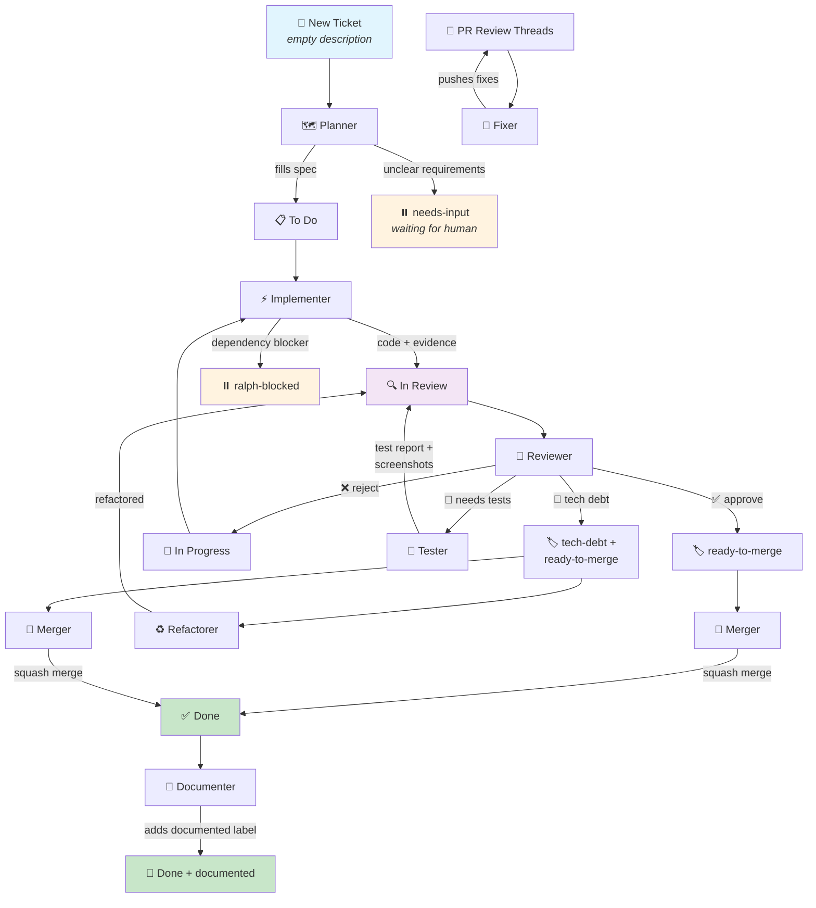

# Ralph Agent Ecosystem

Ralph is a suite of autonomous agents that orchestrate Claude CLI for backlog-driven SDLC automation. Each agent acts as a specialized team member, picking up tasks from your backlog based on specific criteria.


## Install

```bash
git clone <repo-url> ralph
cd ralph
npm link
```

This installs the `ralph` command globally. Run it from any project directory.

To uninstall: `npm unlink -g ralph`

## Configuration

### Quick Start

```bash
cd your-project
ralph init          # Creates .ralphrc + .mcp.json from templates
# Edit .ralphrc with your credentials
ralph config        # Verify configuration
```

### `.ralphrc`

Ralph loads `.ralphrc` from the current working directory. This file sets your backlog provider and credentials:

**Jira Provider:**
```zsh
export RALPH_PROVIDER="jira"
export JIRA_EMAIL="you@example.com"
export JIRA_API_TOKEN="your-token"
export JIRA_BASE_URL="https://yourorg.atlassian.net"
export RALPH_POLL_INTERVAL=5
```

**Linear Provider:**
```zsh
export RALPH_PROVIDER="linear"
export LINEAR_API_KEY="lin_api_..."
export LINEAR_TEAM_KEY="ENG"
export RALPH_POLL_INTERVAL=5
```

**GitHub Issues Provider:**
```zsh
export RALPH_PROVIDER="github-issues"
export GITHUB_REPO="owner/repo"
export RALPH_POLL_INTERVAL=5
# gh CLI handles auth via GITHUB_TOKEN or `gh auth login`
```

**GitHub Projects Provider:**
```zsh
export RALPH_PROVIDER="github-projects"
export GITHUB_REPO="owner/repo"
export GITHUB_PROJECT_NUMBER=1
export RALPH_POLL_INTERVAL=5
# gh CLI handles auth via GITHUB_TOKEN or `gh auth login`
```

**File Provider:**
```zsh
export RALPH_PROVIDER="file"
export RALPH_PRD_FILE="./prd.md"  # Optional, defaults to ./prd.md
export RALPH_POLL_INTERVAL=5
```

Alternatively, set these as environment variables in your shell profile.

## Commands

```
ralph <command> [options]

Agent commands (backlog-driven):
  planner           Run the Planner agent
  implementer       Run the Implementer agent
  reviewer          Run the Reviewer agent
  tester            Run the Tester agent
  refactor          Run the Refactorer agent
  documenter        Run the Documenter agent

GitHub commands:
  fixer             Respond to PR review feedback
  merger            Auto-merge approved PRs

Agent options:
  --afk             Run in continuous poll loop (default)
  --once            Run a single iteration, then exit

Debugging:
  debug <agent> [N] Tail a running agent's output (default: instance 1)
    -f, --follow    Live tail (like tail -f)
    -n, --lines N   Number of lines to show (default: 200)
    --raw           Show raw JSON instead of rendered text

Utility commands:
  status            Show task counts and running instances for all agents
  validate          Run routing validation (--matrix, --check-prompts, --check-loops, --check-all)
  init              Create .ralphrc + .mcp.json in current directory
  config            Show current configuration
  version           Show version
```

### Agent Loops

Each agent runs an infinite poll loop: check for work, invoke Claude, parse output, cooldown, repeat.

**Backlog-gated agents** poll a provider (Jira/Linear/GitHub Issues/GitHub Projects/file) for matching tasks:

| Command              | Role          | Trigger                                                  |
| :------------------- | :------------ | :------------------------------------------------------- |
| `ralph planner`      | Product Owner | Description empty/TODO, or label `needs-planning`        |
| `ralph implementer`  | Developer     | Status "To Do"/"In Progress", description filled         |
| `ralph reviewer`     | QA/Lead       | Status "In Review"                                       |
| `ralph tester`       | QA Engineer   | Label `needs-tests`, not Done                            |
| `ralph refactor`     | Architect     | Label `tech-debt`                                        |
| `ralph documenter`   | Tech Writer   | Status "Done", not yet documented                        |

**GitHub-gated agents** poll for PRs via `gh` CLI:

| Command              | Role          | Trigger                                                  |
| :------------------- | :------------ | :------------------------------------------------------- |
| `ralph fixer`        | Developer     | Open PRs with unresolved review threads                  |
| `ralph merger`       | Release Eng   | Approved PRs passing all checks                          |

### Running a Full Team

```bash
# Run each agent in a separate terminal tab:
ralph planner        # Tab 1
ralph implementer    # Tab 2
ralph reviewer       # Tab 3
ralph tester         # Tab 4
ralph refactor       # Tab 5
ralph documenter     # Tab 6
ralph fixer          # Tab 7
ralph merger         # Tab 8
```

### Multi-Instance Support

Agents claim numbered slots in `/tmp/ralph-{agent}/{n}`. Instance number determines which task to pick (instance 1 picks task 1, instance 2 picks task 2, etc.). Stale PIDs are auto-cleaned.

```bash
# Run two implementers in parallel (separate terminals):
ralph implementer    # Picks task #1
ralph implementer    # Picks task #2
```

### Debugging Running Agents

```bash
ralph debug implementer         # Last 200 lines of rendered output
ralph debug implementer -f      # Live tail
ralph debug implementer 2 --raw # Raw JSON from instance 2
ralph status                    # Task counts + running instances overview
```

## Providers

Ralph abstracts the backlog system. Set `RALPH_PROVIDER` to switch providers.

### Supported Providers

- **jira** (default) — Jira Cloud via a bundled MCP server (`ralph-jira-mcp`)
- **linear** — Linear via a bundled MCP server (`ralph-linear-mcp`)
- **github-issues** — GitHub Issues with label-based statuses (`status:to-do`, etc.) via `gh` CLI
- **github-projects** — GitHub Projects v2 with board column statuses via `gh` CLI + GraphQL
- **file** — Local markdown file (prd.md)

### Provider Architecture

Each provider consists of 3 files:

| File | Purpose |
| :--- | :------ |
| `lib/providers/<name>.sh` | Shell: `PROVIDER_ENV_VARS` array + `provider_check_tasks()` function |
| `providers/<name>/instructions.md` | Claude system prompt overlay with tool mappings |
| `providers/<name>/routing.json` | Queries and routing rules per agent |

### File Provider

The file provider lets you use Ralph with a local markdown file instead of a cloud backlog system. Tasks are defined as H2 sections with metadata in HTML comments.

**Task Format:**
```markdown
## USER-001: Feature Name
<!-- status: to-do -->
<!-- labels: enhancement, needs-planning -->
<!-- priority: high -->

Description content here...

### Acceptance Criteria
- [ ] Item 1
```

**Supported Statuses:** `to-do`, `in-progress`, `in-review`, `done`

**Standard Labels:** `needs-planning`, `needs-tests`, `tech-debt`, `ralph-blocked`, `ralph-failed`, `needs-input`, `documented`

**Query Syntax:**
- `status:to-do,in-progress` — status IN list
- `!status:done` — status NOT in list
- `label:needs-tests` — has label
- `!label:tech-debt` — doesn't have label
- `description:empty` — description is empty or contains TODO
- `!description:empty` — description is not empty
- `(condition OR condition)` — OR groups

**Example:** See `examples/prd.md` for a complete template.

### GitHub Issues Provider

Uses issue labels as statuses (`status:to-do`, `status:in-progress`, `status:in-review`, `status:done`). Agents interact via `gh` CLI — no MCP server needed.

Status changes are label swaps:
```bash
gh issue edit 123 --repo owner/repo --remove-label "status:to-do" --add-label "status:in-progress"
```

### GitHub Projects Provider

Uses GitHub Projects v2 board columns for statuses (`Todo`, `In Progress`, `In Review`, `Done`). Labels are still managed on the underlying issues. Agents use `gh api graphql` for status mutations and `gh issue edit` for labels/comments.

Requires `GITHUB_PROJECT_NUMBER` in addition to `GITHUB_REPO`.

### Adding a New Provider

1. **`lib/providers/<name>.sh`** — Implement `PROVIDER_ENV_VARS` and `provider_check_tasks()`
2. **`providers/<name>/instructions.md`** — Map generic workflow concepts to provider-specific tools
3. **`providers/<name>/routing.json`** — Provider-specific queries per agent

No changes to core lib, bin wrappers, or base prompts needed.

## Routing

All agent routing rules live in `providers/<provider>/routing.json` — the single source of truth for queries.

### Validating Routing

```bash
ralph validate                  # Simulates ~168 ticket states, reports overlaps/gaps
ralph validate --matrix         # Full matrix — which agents match every simulated state
ralph validate --check-prompts  # Detect query drift between routing.json and prompts
ralph validate --check-loops    # Check self-loop risks
ralph validate --check-all      # Run all checks
```

When adding or modifying agent routing:
1. Update `routing.json` (both `query` and `rules`)
2. Update the corresponding `prompts/*.md` query to match
3. Run `ralph validate --check-all` to verify

## Labels

| Label             | Purpose                                              |
| :---------------- | :--------------------------------------------------- |
| `needs-planning`  | Ticket needs (re-)planning by the Planner agent      |
| `needs-tests`     | Ticket needs test coverage. Routed to Tester         |
| `tech-debt`       | Code is functional but needs refactoring. Routed to Refactorer |
| `ralph-blocked`   | Implementer hit a blocker it cannot resolve          |
| `ralph-failed`    | Build or test failure during implementation          |
| `needs-input`     | Planner needs human clarification on requirements    |
| `documented`      | Documenter has updated docs for this ticket          |

## Workflow



1.  **Planner** finds empty/TODO tickets (or `needs-planning`), adds specs, moves to **To Do**.
2.  **Implementer** picks up **To Do**/**In Progress** (excludes `needs-tests`, `tech-debt`, `ralph-blocked`, `needs-planning`, `needs-input`; skips tasks blocked by unfinished dependencies), writes code, moves to **In Review** once verified with evidence.
3.  **Reviewer** checks code in **In Review** (excludes `needs-planning`, `needs-tests`, `tech-debt`, `needs-input`, `ready-to-merge`):
    - **Approve**: Adds `ready-to-merge` label to PR and ticket, stays **In Review** (Merger picks up).
    - **Reject**: Moves back to **In Progress** (Implementer re-picks), optionally adds `ralph-failed`.
    - **Needs Tests**: Adds `needs-tests`, moves to **To Do** (Tester picks up).
    - **Tech Debt**: Adds `tech-debt` + `ready-to-merge` to PR, stays **In Review** (Merger merges; Refactorer picks up tech-debt later).
4.  **Tester** picks up `needs-tests` (not Done), removes `needs-tests`, adds test evidence with screenshots, moves to **In Review**.
5.  **Refactorer** picks up `tech-debt`, refactors, removes `tech-debt`, moves to **In Review**.
6.  **Documenter** picks up **Done** items (excludes `tech-debt`, `documented`, `needs-input`), updates docs, adds `documented` label.
7.  **Fixer** picks up open PRs with unresolved review threads, addresses feedback, pushes fixes.
8.  **Merger** picks up PRs with `ready-to-merge` label + passing CI, squash-merges, transitions ticket to **Done**.

## Project Structure

```
ralph/
├── bin/
│   └── ralph                    # CLI entry point
├── lib/
│   ├── ralph-core.sh            # Shared functions
│   ├── ralph-gated-loop.sh      # Backlog-gated poll loop
│   ├── ralph-github-loop.sh     # GitHub-gated poll loop (fixer, merger)
│   └── providers/
│       ├── jira.sh              # Jira provider implementation
│       ├── linear.sh            # Linear provider implementation
│       ├── github-issues.sh     # GitHub Issues provider (label-based statuses)
│       ├── github-projects.sh   # GitHub Projects v2 provider (board columns)
│       ├── file.sh              # File provider implementation
│       └── file-query.awk       # File query parser
├── prompts/                     # Provider-agnostic workflow prompts
│   ├── planner.md
│   ├── implementer.md
│   ├── reviewer.md
│   ├── tester.md
│   ├── refactor.md
│   ├── documenter.md
│   ├── fixer.md
│   └── merger.md
├── providers/
│   ├── jira/
│   │   ├── instructions.md      # Jira MCP tool mappings
│   │   ├── routing.json         # Jira queries + validation rules
│   │   └── mcp-server.mjs       # Bundled Jira MCP server
│   ├── linear/
│   │   ├── instructions.md      # Linear MCP tool mappings
│   │   └── routing.json         # Linear queries + validation rules
│   ├── github-issues/
│   │   ├── instructions.md      # GitHub Issues gh CLI instructions
│   │   └── routing.json         # GitHub Issues queries + validation rules
│   ├── github-projects/
│   │   ├── instructions.md      # GitHub Projects v2 GraphQL instructions
│   │   └── routing.json         # GitHub Projects queries + validation rules
│   └── file/
│       ├── instructions.md      # File provider instructions
│       └── routing.json         # File queries + validation rules
├── examples/
│   └── prd.md                   # Example PRD template for file provider
├── package.json
├── .ralphrc.example
└── README.md
```
